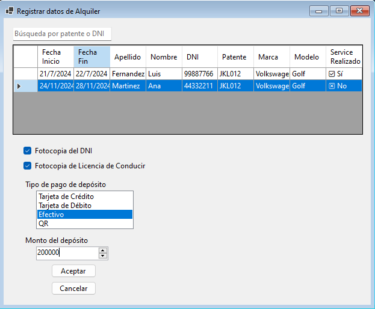
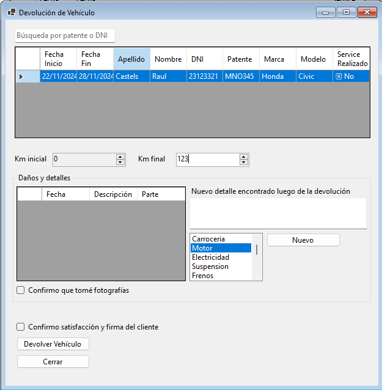

## Gestión de Alquileres

- [Registrar Alquiler](#registrar-alquiler)
- [Entrega de Vehículo](#entrega-de-vehículo)
- [Devolución de Vehículo](#devolución-de-vehículo)
- [Revisión Final de Alquiler](#revisión-final-de-alquiler)

---

### Registrar Alquiler

**Acceso**: Esta funcionalidad está disponible para los recepcionistas.

**Ubicación en el Menú**:  
- Ir a **Gestión de Alquileres** → **Registrar Alquiler**.

**Pasos para registrar un alquiler**:

1. **Seleccionar Reserva**:  
   - En la pantalla aparecerá un listado con todas las reservas en estado **Lista**.
   - Selecciona la reserva correspondiente al cliente que ha venido a retirar el vehículo.

2. **Registrar Información Adicional**:  
   - Registra la **fotocopia del DNI** y el **registro de manejo** del cliente.
   - Registra el **pago del depósito** (método de pago y monto).

3. **Confirmar Alquiler**:  
   - Haz clic en **Aceptar** para confirmar el alquiler. El alquiler pasará de estado **Pendiente** a **Confirmado**.

**Validaciones Importantes**:
- No podrás confirmar el alquiler si no has registrado todos los datos requeridos.

---

### Entrega de Vehículo

**Acceso**: Esta funcionalidad está disponible para los inspectores de vehículos.

**Ubicación en el Menú**:  
- Ir a **Gestión de Alquileres** → **Entrega de Vehículo**.

**Pasos para entregar un vehículo**:

1. **Seleccionar Alquiler**:  
   - En la pantalla aparecerá un listado con todos los alquileres en estado **Confirmado**.
   - Selecciona el alquiler correspondiente al cliente que está listo para recibir el vehículo.

2. **Registrar Detalles del Vehículo**:  
   - Registra los **kilómetros iniciales** del vehículo en el campo correspondiente.
   - Completa la **sección de Daños y Detalles**: escribe cualquier daño visible y selecciona la parte del vehículo a la que corresponde.
   - Marca el **checkbox** para confirmar que se han tomado **fotografías del vehículo**.
   - Marca el **checkbox** para confirmar la **satisfacción y firma del cliente**.

3. **Entregar Vehículo**:  
   - Haz clic en **Entregar Vehículo**. El alquiler pasará al estado **En curso** y el vehículo al estado **Alquilado**.

**Validaciones Importantes**:
- No podrás entregar el vehículo si no has registrado todos los detalles necesarios.

---

### Devolución de Vehículo

**Acceso**: Esta funcionalidad está disponible para los inspectores de vehículos.

**Ubicación en el Menú**:  
- Ir a **Gestión de Alquileres** → **Devolución de Vehículo**.

**Pasos para registrar la devolución de un vehículo**:

1. **Seleccionar Alquiler**:  
   - En la pantalla aparecerá un listado con todos los alquileres en estado **En curso**.
   - Selecciona el alquiler correspondiente al cliente que ha devuelto el vehículo.

2. **Registrar Detalles de Devolución**:  
   - Registra los **nuevos kilómetros** del vehículo.
   - Completa la **sección de Daños y Detalles**, similar a la entrega del vehículo.
   - Marca los **checkboxes** para confirmar que se han tomado **fotografías del vehículo** y la **satisfacción del cliente**.

3. **Devolver Vehículo**:  
   - Haz clic en **Devolver Vehículo**. El alquiler pasará al estado **En revisión de devolución** y el vehículo al estado **Devuelto**.

**Validaciones Importantes**:
- No podrás registrar la devolución del vehículo si no has completado todos los detalles requeridos.

---

### Revisión Final de Alquiler

**Acceso**: Esta funcionalidad está disponible para los supervisores generales.

**Ubicación en el Menú**:  
- Ir a **Gestión de Alquileres** → **Revisión Final de Alquiler**.

**Pasos para revisar el alquiler devuelto**:

1. **Seleccionar Alquiler**:  
   - En la pantalla aparecerá un listado con todos los alquileres en estado **En revisión de devolución**.
   - Selecciona el alquiler que deseas revisar.

2. **Revisar Detalles del Vehículo**:  
   - Verifica los **kilómetros iniciales y finales** del vehículo. Estos campos estarán grisados.
   - Marca si el **kilometraje coincide con el esperado**.
   - Completa la **sección de Daños y Detalles** si encuentras algún daño adicional al devolver el vehículo.
   - Selecciona si **los daños nuevos son significativos y el cliente deberá pagar un excedente** (opciones **Sí** o **No**).
   - Indica si **el cliente tuvo alguna multa durante su viaje** (opciones **Sí** o **No**).
   - Completa el campo de **Observaciones Finales** si es necesario.

3. **Finalizar Revisión**:  
   - Haz clic en **Marcar como Pendiente de Resolución** si el cliente debe pagar un excedente o tiene multas, para que se realice un seguimiento.
   - Haz clic en **Finalizar** para cerrar el alquiler. El alquiler pasará al estado **Finalizado**.

**Validaciones Importantes**:
- No podrás finalizar la revisión si no has completado todos los detalles necesarios.

---