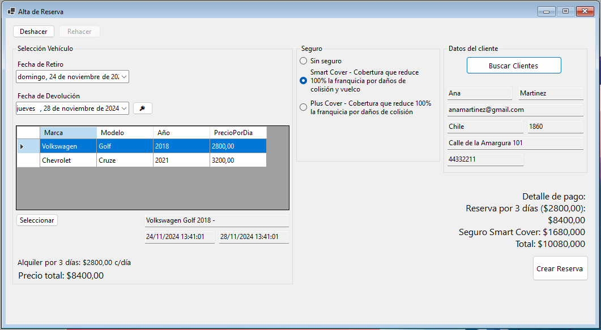
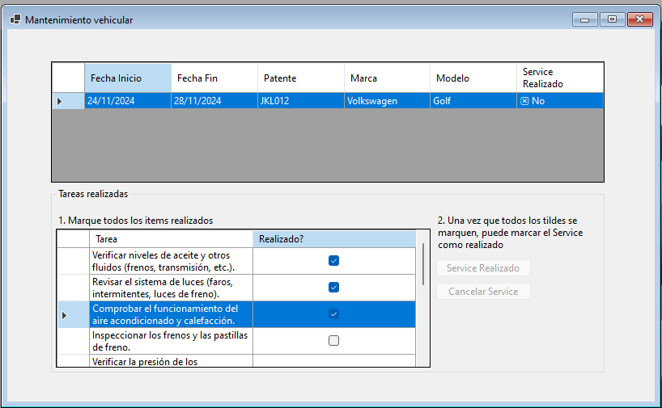

# Guía del Usuario del Sistema de Alquiler de Vehículos

### Índice
1. [Introducción](#1-introducción)
2. [Gestión de Reservas](#2-gestión-de-reservas)
   1. [Crear Nueva Reserva](#21-crear-nueva-reserva)
   2. [Modificar Reserva](#22-modificar-reserva)
   3. [Cancelar Reserva](#23-cancelar-reserva)
   4. [Preparar Vehículos para Alquiler](#24-preparar-vehículos-para-alquiler)
3. [Gestión de Alquileres](#3-gestión-de-alquileres)
   1. [Registrar Alquiler](#31-registrar-alquiler)
   2. [Entrega de Vehículo](#32-entrega-de-vehículo)
   3. [Devolución de Vehículo](#33-devolución-de-vehículo)
   4. [Revisión Final de Alquiler](#34-revisión-final-de-alquiler)
4. [Gestión de Vehículos](#4-gestión-de-vehículos)
   1. [Supervisar Vehículos](#41-supervisar-vehículos)
   2. [Revisar Reparaciones](#42-revisar-reparaciones)
   3. [Revisar Historial de Mantenimiento](#43-revisar-historial-de-mantenimiento)

### 1. Introducción

Bienvenido a la Guía del Usuario del Sistema de Alquiler de Vehículos. Este documento está diseñado para ayudarte a comprender cómo utilizar las funciones clave del sistema de una manera sencilla y eficiente. Si eres recepcionista, supervisor, mecánico, inspector de vehículos o administrador, esta guía te proporcionará instrucciones claras sobre cómo realizar tus tareas diarias.

En esta sección, cubriremos la **Gestión de Reservas**, la **Gestión de Alquileres** y la **Gestión de Vehículos**, que incluyen la creación, modificación, cancelación de reservas, preparación de vehículos para el alquiler, registrar alquileres y gestionar la entrega y devolución de vehículos, así como el mantenimiento y supervisión de los vehículos disponibles.

---

### 2. Gestión de Reservas

#### 2.1 Crear Nueva Reserva

**Acceso**: Esta funcionalidad está disponible para los recepcionistas.

**Ubicación en el Menú**:  
- Ir a **Reservas** → **Gestión de Reservas** → **Nueva Reserva**.

**Pasos para crear una reserva**:

1. **Seleccionar Vehículo**:  
   - Selecciona la **Fecha de Retiro** y la **Fecha de Devolución**.
   - Haz clic en **Buscar**. El sistema listará todos los vehículos disponibles para ese rango de fechas.
   - Selecciona un vehículo del listado y haz clic en **Seleccionar**. El precio total se actualizará de acuerdo al vehículo y las fechas elegidas.

2. **Seleccionar Seguro**:  
   - Selecciona la preferencia del cliente haciendo clic en uno de los **botones de opción (radio button)** disponibles.

3. **Buscar Cliente**:  
   - Haz clic en **Buscar Cliente**. Se abrirá un pop-up con un listado de clientes disponibles.
   - Si el cliente no está en la base de datos, puedes dar de alta al cliente directamente desde este pop-up.

4. **Crear Reserva**:  
   - Una vez seleccionados el vehículo y el cliente, haz clic en **Crear Reserva** para generar la reserva.

**Validaciones Importantes**:
- No podrás hacer clic en **Crear Reserva** si no has seleccionado un vehículo y un cliente.

---

#### 2.2 Modificar Reserva

**Acceso**: Esta funcionalidad está disponible para los recepcionistas.

**Ubicación en el Menú**:  
- Ir a **Reservas** → **Gestión de Reservas** → **Modificar Reserva**.

**Pasos para modificar una reserva**:

1. **Seleccionar Reserva**:  
   - Aparecerá un listado de reservas existentes. Selecciona la reserva que deseas modificar.

2. **Modificar Detalles**:  
   - Puedes modificar detalles como las fechas de retiro y devolución o cambiar el vehículo, siempre y cuando esté disponible.

3. **Guardar Cambios**:  
   - Haz clic en **Guardar Cambios** para confirmar la modificación.

**Validaciones Importantes**:
- Solo se pueden modificar reservas que no hayan comenzado o que no estén en estado de cancelación.

---

#### 2.3 Cancelar Reserva

**Acceso**: Esta funcionalidad está disponible para los supervisores y gerentes de atención al cliente.

**Ubicación en el Menú**:  
- Ir a **Reservas** → **Gestión de Reservas** → **Cancelar Reserva**.

**Pasos para cancelar una reserva**:

1. **Seleccionar Reserva**:  
   - En la pantalla aparecerá un listado de todas las reservas en estado **Pendiente**.
   - Selecciona la reserva que deseas cancelar.

2. **Motivo de Cancelación**:  
   - Escribe el motivo de la cancelación en el campo **Motivo de Cancelación**.

3. **Cancelar Reserva**:  
   - Haz clic en **Cancelar Reserva** para confirmar la cancelación.

**Validaciones Importantes**:
- No podrás cancelar la reserva si no has proporcionado un motivo de cancelación.

---

#### 2.4 Preparar Vehículos para Alquiler

**Acceso**: Esta funcionalidad está disponible para los empleados del taller.

**Ubicación en el Menú**:  
- Ir a **Reservas** → **Gestión de Mantenimiento** → **Vehículos en Reserva**.

**Pasos para preparar un vehículo**:

1. **Seleccionar Vehículo**:  
   - El sistema mostrará un listado con todos los vehículos que están en reserva y necesitan preparación.
   - Selecciona el vehículo que deseas preparar.

2. **Realizar Tareas de Preparación**:  
   - El sistema mostrará una lista de tareas que deben completarse (e.g., limpiar exterior, limpiar interior, inflar ruedas).
   - Marca cada tarea como completada una vez realizada.

3. **Finalizar Preparación**:  
   - Cuando todas las tareas estén marcadas, el botón **Service Realizado** se habilitará. Haz clic para finalizar la preparación y marcar la reserva como **Lista**.

**Validaciones Importantes**:
- No podrás marcar el servicio como realizado hasta que todas las tareas hayan sido completadas.

---

### 3. Gestión de Alquileres

#### 3.1 Registrar Alquiler

**Acceso**: Esta funcionalidad está disponible para los recepcionistas.

**Ubicación en el Menú**:  
- Ir a **Gestión de Alquileres** → **Registrar Alquiler**.

**Pasos para registrar un alquiler**:

1. **Seleccionar Reserva**:  
   - En la pantalla aparecerá un listado con todas las reservas en estado **Lista**.
   - Selecciona la reserva correspondiente al cliente que ha venido a retirar el vehículo.

2. **Registrar Información Adicional**:  
   - Registra la **fotocopia del DNI** y el **registro de manejo** del cliente.
   - Registra el **pago del depósito** (método de pago y monto).

3. **Confirmar Alquiler**:  
   - Haz clic en **Aceptar** para confirmar el alquiler. El alquiler pasará de estado **Pendiente** a **Confirmado**.

**Validaciones Importantes**:
- No podrás confirmar el alquiler si no has registrado todos los datos requeridos.

---

#### 3.2 Entrega de Vehículo

**Acceso**: Esta funcionalidad está disponible para los inspectores de vehículos.

**Ubicación en el Menú**:  
- Ir a **Gestión de Alquileres** → **Entrega de Vehículo**.

**Pasos para entregar un vehículo**:

1. **Seleccionar Alquiler**:  
   - En la pantalla aparecerá un listado con todos los alquileres en estado **Confirmado**.
   - Selecciona el alquiler correspondiente al cliente que está listo para recibir el vehículo.

2. **Registrar Detalles del Vehículo**:  
   - Registra los **kilómetros iniciales** del vehículo en el campo correspondiente.
   - Completa la **sección de Daños y Detalles**: escribe cualquier daño visible y selecciona la parte del vehículo a la que corresponde.
   - Marca el **checkbox** para confirmar que se han tomado **fotografías del vehículo**.
   - Marca el **checkbox** para confirmar la **satisfacción y firma del cliente**.

3. **Entregar Vehículo**:  
   - Haz clic en **Entregar Vehículo**. El alquiler pasará al estado **En curso** y el vehículo al estado **Alquilado**.

**Validaciones Importantes**:
- No podrás entregar el vehículo si no has registrado todos los detalles necesarios.

---

#### 3.3 Devolución de Vehículo

**Acceso**: Esta funcionalidad está disponible para los inspectores de vehículos.

**Ubicación en el Menú**:  
- Ir a **Gestión de Alquileres** → **Devolución de Vehículo**.

**Pasos para registrar la devolución de un vehículo**:

1. **Seleccionar Alquiler**:  
   - En la pantalla aparecerá un listado con todos los alquileres en estado **En curso**.
   - Selecciona el alquiler correspondiente al cliente que ha devuelto el vehículo.

2. **Registrar Detalles de Devolución**:  
   - Registra los **nuevos kilómetros** del vehículo.
   - Completa la **sección de Daños y Detalles**, similar a la entrega del vehículo.
   - Marca los **checkboxes** para confirmar que se han tomado **fotografías del vehículo** y la **satisfacción del cliente**.

3. **Devolver Vehículo**:  
   - Haz clic en **Devolver Vehículo**. El alquiler pasará al estado **En revisión de devolución** y el vehículo al estado **Devuelto**.

**Validaciones Importantes**:
- No podrás registrar la devolución del vehículo si no has completado todos los detalles requeridos.

---

#### 3.4 Revisión Final de Alquiler

**Acceso**: Esta funcionalidad está disponible para los supervisores generales.

**Ubicación en el Menú**:  
- Ir a **Gestión de Alquileres** → **Revisión Final de Alquiler**.

**Pasos para revisar el alquiler devuelto**:

1. **Seleccionar Alquiler**:  
   - En la pantalla aparecerá un listado con todos los alquileres en estado **En revisión de devolución**.
   - Selecciona el alquiler que deseas revisar.

2. **Revisar Detalles del Vehículo**:  
   - Verifica los **kilómetros iniciales y finales** del vehículo. Estos campos estarán grisados.
   - Marca si el **kilometraje coincide con el esperado**.
   - Completa la **sección de Daños y Detalles** si encuentras algún daño adicional al devolver el vehículo.
   - Selecciona si **los daños nuevos son significativos y el cliente deberá pagar un excedente** (opciones **Sí** o **No**).
   - Indica si **el cliente tuvo alguna multa durante su viaje** (opciones **Sí** o **No**).
   - Completa el campo de **Observaciones Finales** si es necesario.

3. **Finalizar Revisión**:  
   - Haz clic en **Marcar como Pendiente de Resolución** si el cliente debe pagar un excedente o tiene multas, para que se realice un seguimiento.
   - Haz clic en **Finalizar** para cerrar el alquiler. El alquiler pasará al estado **Finalizado**.

**Validaciones Importantes**:
- No podrás finalizar la revisión si no has completado todos los detalles necesarios.

---

### 4. Gestión de Vehículos

#### 4.1 Supervisar Vehículos

**Acceso**: Esta funcionalidad está disponible para los supervisores.

**Ubicación en el Menú**:  
- Ir a **Gestión de Vehículos** → **Supervisar Vehículos**.

**Pasos para supervisar un vehículo**:

1. **Seleccionar Vehículo**:  
   - En la pantalla aparecerá un listado de vehículos que se encuentran en estado **Disponible** o **Devuelto**.
   - Selecciona el vehículo que deseas supervisar.

2. **Revisar Estado del Vehículo**:  
   - Revisa los detalles del vehículo, incluyendo su historial de mantenimiento y condiciones actuales.

3. **Tomar Acción**:  
   - Puedes elegir entre **Enviar a Mantenimiento** o **Disponibilizar** el vehículo.
   - Si decides **Enviar a Mantenimiento**, el vehículo cambiará al estado **Requiere Mantenimiento**.
   - Si decides **Disponibilizar** el vehículo, el estado cambiará a **Disponible**, lo cual permite que el vehículo sea alquilado nuevamente.

**Validaciones Importantes**:
- No podrás enviar un vehículo a mantenimiento o disponibilizarlo sin seleccionarlo previamente.

---

#### 4.2 Revisar Reparaciones

**Acceso**: Esta funcionalidad está disponible para los mecánicos.

**Ubicación en el Menú**:  
- Ir a **Gestión de Vehículos** → **Revisar Reparaciones**.

**Pasos para revisar las reparaciones de un vehículo**:

1. **Seleccionar Vehículo**:  
   - Aparecerá un listado con los vehículos en estado **Requiere Mantenimiento**.
   - Selecciona el vehículo que deseas revisar.

2. **Revisar Pedidos de Reparación**:  
   - Se mostrarán los pedidos de reparación asociados al vehículo seleccionado.
   - Selecciona cada ítem del listado y marca si está **Solucionado** o **No Solucionado**.

3. **Finalizar Reparación**:  
   - Una vez que todos los ítems estén marcados, podrás decidir si el vehículo se considera **Reparado** o **No Reparado**.

**Validaciones Importantes**:
- No podrás finalizar la revisión sin marcar el estado de todos los pedidos de reparación.

---

#### 4.3 Revisar Historial de Mantenimiento

**Acceso**: Esta funcionalidad está disponible para los supervisores generales.

**Ubicación en el Menú**:  
- Ir a **Gestión de Vehículos** → **Revisar Historial**.

**Pasos para revisar el historial de mantenimiento de un vehículo**:

1. **Seleccionar Vehículo**:  
   - En la pantalla aparecerá un listado con todos los vehículos disponibles.
   - Selecciona el vehículo que deseas revisar.

2. **Revisar Historial**:  
   - Se mostrarán detalles sobre el historial de mantenimiento del vehículo, incluyendo reparaciones previas, kilometraje, y otros datos relevantes.

3. **Tomar Decisión**:  
   - Puedes decidir **Vender** el vehículo si consideras que ya no es adecuado para el alquiler. Esto cambiará el estado del vehículo a **En Venta**.
   - También puedes **Disponibilizar** el vehículo si está en condiciones de ser alquilado nuevamente.

**Validaciones Importantes**:
- Solo podrás marcar un vehículo como **En Venta** si cumple con los criterios establecidos por la empresa.

---
